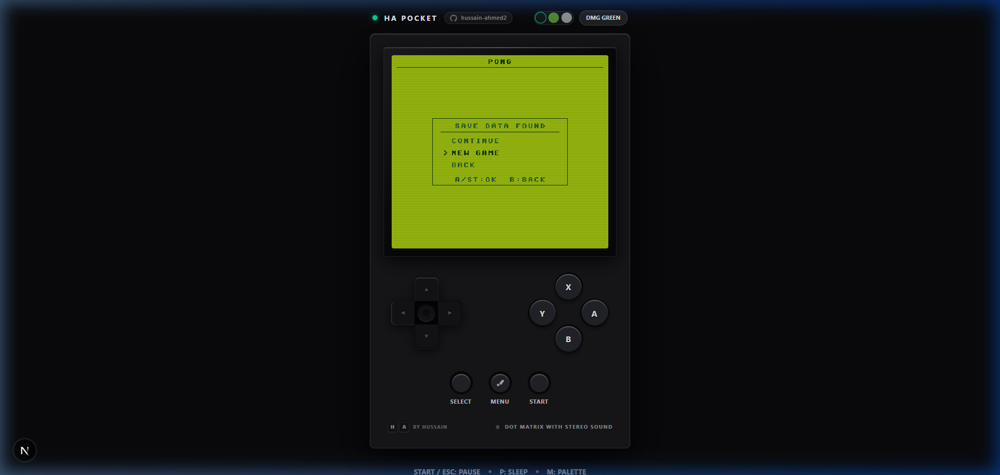
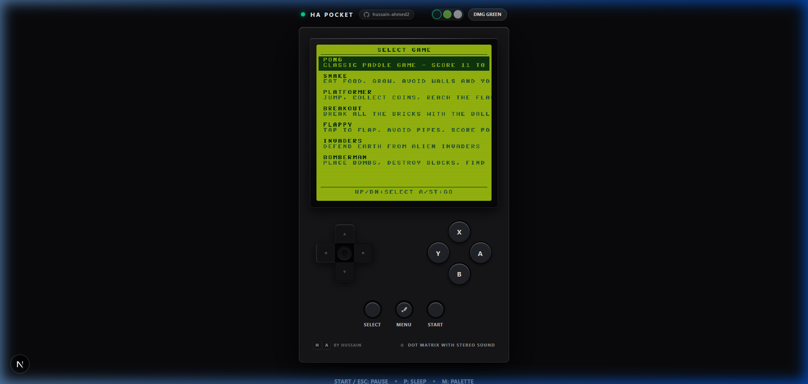

# 🎮 GameBoy Web Engine



A **GameBoy-inspired game engine** built with Next.js 14, React 18, Tailwind CSS v4, and TypeScript. Write games in TypeScript - no ROMs, no assembly, no external tools. The engine provides a GameBoy-compatible API (160×144, 4-color palette, sprites, tilemaps, input, audio) and runs your TypeScript game code at a smooth 60 FPS.

## ✨ Features

- **Authentic DMG Hardware UI** — Tactile, responsive on-screen D-pad and Action buttons designed to feel instantaneous.
- **Custom Hardware Shells** — Swap between Noir, Kiwi, and Pure White hardware chassis themes.
- **Display Palettes** — Choose between Original DMG, Pocket, and Light screen color palettes.
- **TypeScript Game API** — Sprites, TileMaps, Entities, Input, Audio wrapper.
- **Built-in Games** — Pong, Snake, Snake 2, Tetris, Bomberman, Platformer (all written purely in TypeScript).
- **Save States & Configs** — Persist game progress and user UI configurations to `localStorage` (with zero Next.js SSR hydration flashes).
- **Keyboard + Touch** — Play smoothly on desktop or mobile.
- **60 FPS Fixed Timestep** — Deterministic `requestAnimationFrame` game loop.

## 📸 Menu Interface


*(Game selection menu showing the custom screen palette)*

---

## 🛠️ Tech Stack

| Layer | Technology |
|-------|------------|
| Framework | Next.js 14 (App Router) |
| UI | React 18 (`useSyncExternalStore` for config) |
| Styling | Tailwind CSS v4 (CSS-first theme) |
| Language | TypeScript 5 (strict) |
| Testing | Vitest (unit) + Playwright (E2E) |
| Package Manager | pnpm |

## 🚀 Getting Started

### Prerequisites

- Node.js 18+
- pnpm 8+

### Installation

```bash
git clone https://github.com/hussain-ahmed2/gameboy-web-engine.git
cd gameboy-web-engine
pnpm install
```

### Development

```bash
pnpm dev
```

Open [http://localhost:4000](http://localhost:4000) in your browser.

## 🏗️ Architecture

```
src/
├── app/                    # Next.js App Router
│   ├── layout.tsx          # Root layout (fonts, metadata, SEO)
│   ├── page.tsx            # Home page (GameBoy shell + game selector)
│   └── globals.css         # Base styles
│
├── engine/                 # Game engine core
│   ├── core/
│   │   ├── GameLoop.ts     # 60 FPS fixed timestep loop
│   │   ├── Renderer.ts     # Canvas 2D with DMG palette mappings
│   │   ├── Input.ts        # Keyboard/Touch → GamePad state
│   │   ├── Audio.ts        # Web Audio API wrapper (Beeps, Boops, Noise)
│   │   └── SaveState.ts    # localStorage persistence
│   │
│   ├── api/
│   │   ├── Game.ts         # Base Game class (init/update/draw)
│   │   ├── Sprite.ts       # Sprite with position, animation
│   │   ├── TileMap.ts      # Background tile maps
│   │   ├── Entity.ts       # Game entities with components
│   │   └── Sound.ts        # Sound effects / music
│   │
│   └── games/              # Built-in games
│       ├── registry.ts     # Game registry & dynamic loading
│       ├── snake2/         # Classic Snake 2
│       ├── tetris/         # Tetris Clone
│       ├── bomberman/      # Bomberman Clone
│       └── platformer/     # Jump & Run
│
├── features/
│   ├── ui/                 # React components
│   │   ├── shell/          # GameBoy chassis styling
│   │   ├── screen/         # Canvas display + CRT effects
│   │   └── controls/       # Tactile D-pad, A/B, Start/Select buttons
│   │
│   └── store/              # React Context for Engine state
│
├── hooks/
│   ├── useEngine.ts        # Engine lifecycle hook
│   └── useLocalStorage.ts  # SSR-safe local storage hook
│
└── lib/
    ├── types.ts            # Shared TypeScript interfaces
    └── constants.ts        # Screen size, palette, key mapping
```

## 🎮 Game API Example

### Base Game Class
```typescript
import { Game, Sprite, TileMap, Input, Audio } from '@/engine';

export class MyGame extends Game {
  init() {
    // Called once on game start
    this.player = new Sprite({ x: 80, y: 72, frames: [...] });
    this.map = new TileMap({ width: 20, height: 18, tiles: [...] });
  }

  update(input: Input, deltaTime: number) {
    // Called 60 times/second
    if (input.right.pressed) this.player.x += 2;
  }

  draw(renderer: Renderer) {
    // Called after update
    renderer.drawSprite(this.player);
    renderer.drawTileMap(this.map);
  }
}
```

## 🕹️ Controls

### Keyboard
| Key | Action |
|-----|--------|
| Arrow Keys | D-pad |
| Z | A Button |
| X | B Button |
| Enter / ESC | Start (Pause/Select Game) |
| Right Shift | Select (Cycle Display Palettes) |
| M | Toggle Audio Mute |

### Touch (Mobile)
Fully responsive on-screen D-pad and Action buttons designed to prevent ghost-touches and offer immediate feedback.

## 📝 License

MIT